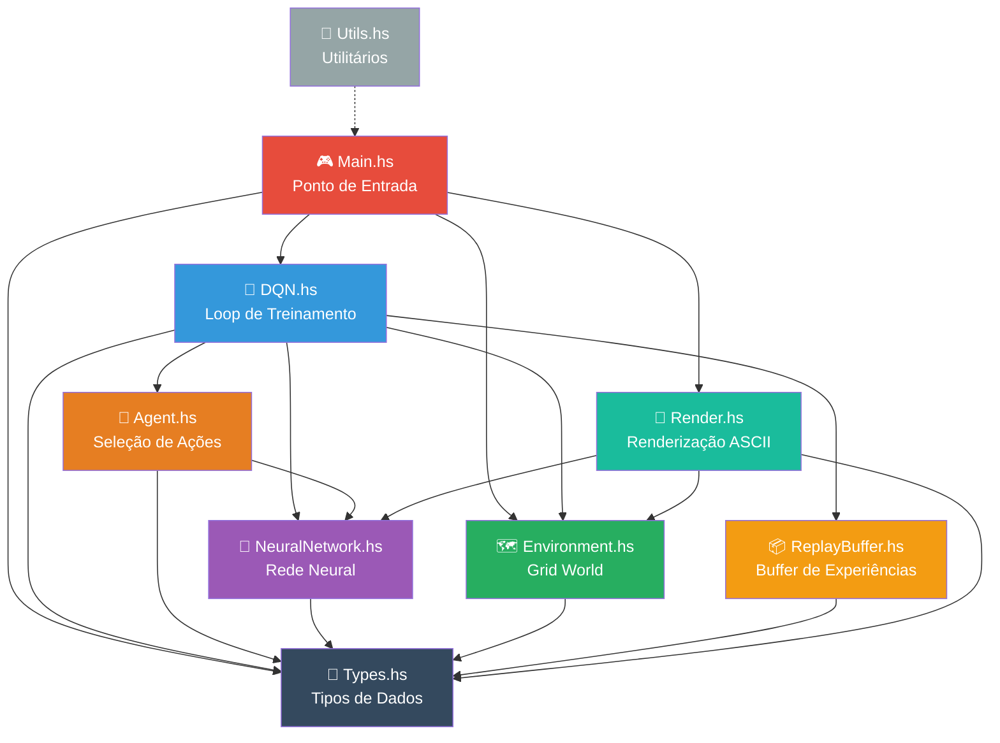
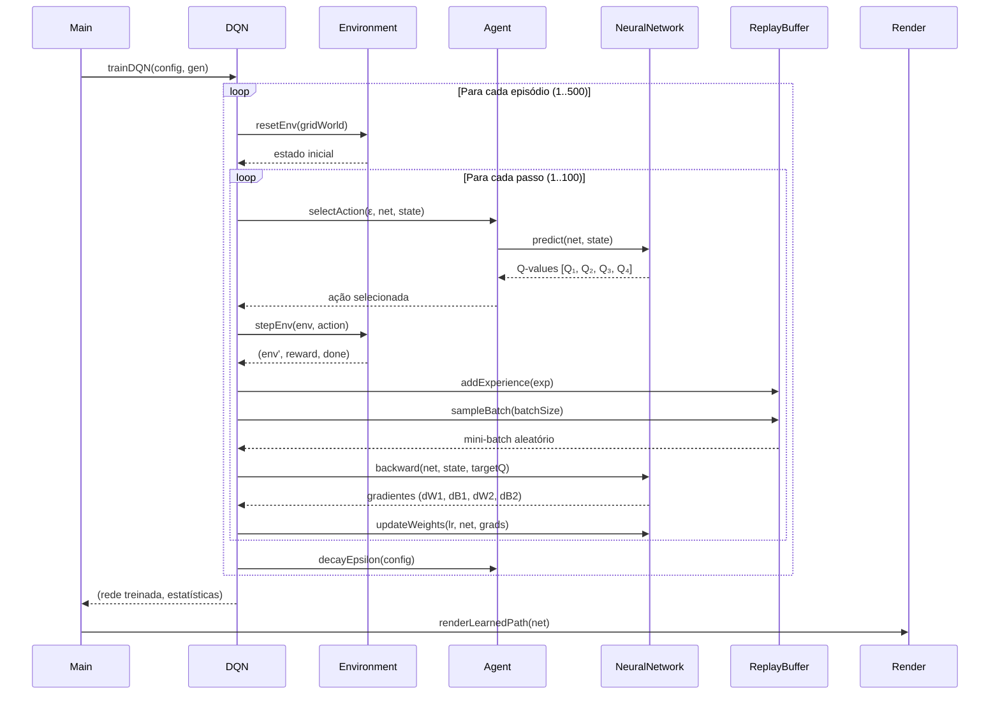

# 🏰 Dungeon AI — Deep Q-Learning em Haskell

<div align="center">

[](https://github.com/robertrichard86/gridworld-deepq-haskell/actions/workflows/haskell.yml)
[](https://opensource.org/licenses/MIT)
[](https://www.haskell.org/)
[](https://www.haskell.org/ghc/)
[](https://docs.haskellstack.org/)

**Um agente de Inteligência Artificial que aprende a navegar por uma dungeon 5×5 usando Deep Q-Learning, implementado inteiramente em Haskell puro.**

*Rede neural construída do zero — sem frameworks de Machine Learning externos.*

[📖 Documentação](#-documentação-completa) · [🚀 Início Rápido](#-início-rápido) · [🧠 Como Funciona](#-como-funciona-deep-q-learning) · [📊 Resultados](#-exemplo-de-saída)

</div>

---

## 📋 Índice

- [Visão Geral](#-visão-geral)
- [Exemplo de Saída](#-exemplo-de-saída)
- [Como Funciona: Deep Q-Learning](#-como-funciona-deep-q-learning)
- [Rede Neural](#-rede-neural)
- [O Grid World — A Dungeon](#-o-grid-world--a-dungeon)
- [Arquitetura do Projeto](#-arquitetura-do-projeto)
- [Estrutura de Arquivos](#-estrutura-de-arquivos)
- [Início Rápido](#-início-rápido)
- [GitHub Codespaces](#-github-codespaces)
- [Testes](#-testes)
- [Configuração e Hiperparâmetros](#-configuração-e-hiperparâmetros)
- [Objetivos Acadêmicos](#-objetivos-acadêmicos)
- [Melhorias Futuras](#-melhorias-futuras)
- [Documentação Completa](#-documentação-completa)
- [Licença](#-licença)

---

## 🌟 Visão Geral

O **Dungeon AI** é um projeto educacional que demonstra a implementação completa de um agente de **Deep Q-Learning (DQN)** em **Haskell**, uma linguagem de programação funcional pura. O agente (representado como um mago 🧙) aprende, por tentativa e erro, a navegar por uma dungeon (Grid World 5×5) até encontrar o tesouro (💎), desviando de armadilhas mortais (🔥).

### ✨ Destaques do Projeto

| Característica | Descrição |
|---|---|
| 🧠 **Rede Neural Manual** | Forward propagation, backpropagation e atualização de pesos implementados do zero com `hmatrix` |
| 🎮 **Ambiente Grid World** | Dungeon 5×5 com obstáculos, posição inicial e objetivo |
| 📦 **Experience Replay** | Buffer circular para armazenar e reamostrar experiências passadas |
| 🎲 **Exploração ε-greedy** | Equilíbrio dinâmico entre exploração e exploração com decaimento exponencial |
| 🎨 **Renderização ASCII** | Visualização temática com emojis medievais (🧙💎🔥⬜🟢) |
| ✅ **Testes Automatizados** | Suite completa com HSpec e QuickCheck |
| 🔄 **CI/CD** | Pipeline GitHub Actions para build e testes automáticos |
| 📐 **Haskell Puro** | Sem dependências de frameworks de ML — apenas álgebra linear (`hmatrix`) |

---

## 📊 Exemplo de Saída

Ao executar o programa, o agente treina por 500 episódios e exibe o progresso em tempo real:

```
╔══════════════════════════════════════════════════════╗
║           🏰  DUNGEON AI  🏰                       ║
║       Deep Q-Learning Grid World Agent              ║
║                                                     ║
║   🧙 Aventureiro   💎 Tesouro   🔥 Armadilha       ║
╚══════════════════════════════════════════════════════╝

📋 Configuration:
   Episodes:      500
   Max Steps:     100
   Hidden Size:   64
   Input Size:    12
   Output Size:   4
   Gamma:         0.99
   Learning Rate: 1.0e-3
   Buffer Size:   10000

🗺️  Initial Grid World:
     0    1    2    3    4
  ┌─────────────────────────┐
0 │ 🧙  ⬜  ⬜  🔥  ⬜ │
1 │ ⬜  🔥  ⬜  ⬜  ⬜ │
2 │ ⬜  ⬜  ⬜  🔥  ⬜ │
3 │ ⬜  🔥  ⬜  ⬜  ⬜ │
4 │ ⬜  ⬜  ⬜  ⬜  💎 │
  └─────────────────────────┘

⏳ Training the agent...

┌──────┬───────────────────────────┬────────┬─────────┬──────────────┬────────┐
│  Ep  │ Reward                    │ Steps  │ Epsilon │ Loss         │ Goal   │
├──────┼───────────────────────────┼────────┼─────────┼──────────────┼────────┤
│ Ep   1 │ Reward:   -104.0 [░░░░░░░░░░] │ Steps:    5 │ ε:  1.000 │ Loss:     0.2847 │ Goal: ❌ │
│ Ep   2 │ Reward:   -107.0 [░░░░░░░░░░] │ Steps:    8 │ ε:  0.995 │ Loss:     0.5213 │ Goal: ❌ │
│ Ep  25 │ Reward:    -22.0 [████░░░░░░] │ Steps:   23 │ ε:  0.882 │ Loss:     0.1456 │ Goal: ❌ │
│ Ep 100 │ Reward:     91.0 [█████████░] │ Steps:   10 │ ε:  0.606 │ Loss:     0.0234 │ Goal: ✅ │
│ Ep 250 │ Reward:     92.0 [█████████░] │ Steps:    9 │ ε:  0.286 │ Loss:     0.0089 │ Goal: ✅ │
│ Ep 500 │ Reward:     92.0 [█████████░] │ Steps:    9 │ ε:  0.082 │ Loss:     0.0012 │ Goal: ✅ │
└──────┴───────────────────────────┴────────┴─────────┴──────────────┴────────┘

╔══════════════════════════════════════════════════════╗
║                📊 TRAINING SUMMARY                  ║
╠══════════════════════════════════════════════════════╣
║  Total Episodes:         500                        ║
║  Goals Reached:          312                        ║
║  Success Rate:          62.4%                       ║
║  Last 50 Success:       94.0%                       ║
║  Avg Reward:             23.5                       ║
║  Best Reward:            94.0                       ║
╚══════════════════════════════════════════════════════╝

╔══════════════════════════════════════════════════════╗
║            🗺️  LEARNED PATH                         ║
╠══════════════════════════════════════════════════════╣
     0    1    2    3    4
  ┌─────────────────────────┐
0 │ 🧙  🟢  🟢  🔥  ⬜ │
1 │ ⬜  🔥  🟢  ⬜  ⬜ │
2 │ ⬜  ⬜  🟢  🔥  ⬜ │
3 │ ⬜  🔥  🟢  🟢  ⬜ │
4 │ ⬜  ⬜  ⬜  🟢  💎 │
  └─────────────────────────┘

║  Legend:                                            ║
║  🧙 = Agent  💎 = Goal  🔥 = Trap  🟢 = Path      ║
╚══════════════════════════════════════════════════════╝

🏰 Dungeon AI training complete!
```

> [!NOTE]
> Os resultados variam a cada execução devido à inicialização aleatória dos pesos da rede neural e à natureza estocástica da exploração ε-greedy. Os valores acima são ilustrativos.

---

## 🧠 Como Funciona: Deep Q-Learning

### Q-Learning Tradicional vs Deep Q-Learning

O **Q-Learning** é um algoritmo de Aprendizado por Reforço (*Reinforcement Learning*) onde um agente aprende uma função Q(s, a) que estima o valor esperado de tomar uma ação *a* em um estado *s*. Na versão tradicional, essa função é armazenada em uma **tabela Q** — uma matriz onde cada linha é um estado e cada coluna é uma ação.

| Aspecto | Q-Learning Tabular | Deep Q-Learning (DQN) |
|---|---|---|
| Representação de Q | Tabela (matriz) | Rede Neural |
| Escalabilidade | Limitada a poucos estados | Suporta espaços contínuos |
| Generalização | Nenhuma | Generaliza entre estados similares |
| Memória | O(S × A) | Parâmetros fixos da rede |
| Complexidade | Simples | Requer backpropagation |

O **Deep Q-Learning** substitui a tabela Q por uma **rede neural** que recebe o estado como entrada e produz os Q-values para cada ação possível como saída. Isso permite que o agente generalize para estados nunca vistos, algo impossível com a abordagem tabular.

### A Equação de Bellman

O fundamento matemático do Q-Learning é a **Equação de Bellman**, que define a relação ótima entre Q-values:

```
Q*(s, a) = r + γ · max_a' Q*(s', a')
```

Onde:
- **Q\*(s, a)** — valor Q ótimo para estado *s* e ação *a*
- **r** — recompensa imediata recebida
- **γ** (gamma) — fator de desconto (0.99 neste projeto)
- **s'** — próximo estado
- **max_a' Q\*(s', a')** — melhor Q-value possível no próximo estado

### Experience Replay

Uma das inovações cruciais do DQN é o **Experience Replay Buffer**. Em vez de treinar a rede apenas com a experiência mais recente, armazenamos tuplas *(s, a, r, s', done)* em um buffer e amostramos mini-batches aleatórios para o treinamento.

**Por quê?**
1. **Quebra correlações temporais** — experiências consecutivas são altamente correlacionadas, o que prejudica o treinamento
2. **Reutilização de dados** — cada experiência pode ser usada múltiplas vezes
3. **Estabilidade** — gradientes mais estáveis levam a uma convergência mais suave

```
Buffer: [(s₁,a₁,r₁,s'₁), (s₂,a₂,r₂,s'₂), ..., (sₙ,aₙ,rₙ,s'ₙ)]
                                    ↓
                         Amostragem aleatória
                                    ↓
                    Mini-batch de 32 experiências
                                    ↓
                        Treinamento da rede
```

### Exploração ε-Greedy

O agente utiliza uma política **ε-greedy** para balancear **exploração** (tentar ações aleatórias) e **explotação** (usar o conhecimento já adquirido):

```
Com probabilidade ε:    → ação aleatória  (exploração)
Com probabilidade 1-ε:  → argmax Q(s, a)  (explotação)
```

O valor de **ε** começa em 1.0 (100% exploração) e decai exponencialmente a cada episódio:

```
ε_novo = max(ε_min, ε_atual × ε_decay)
```

Neste projeto: `ε_min = 0.01`, `ε_decay = 0.995`.

---

## 🔮 Rede Neural

A rede neural deste projeto é implementada **inteiramente do zero**, sem usar frameworks como TensorFlow ou PyTorch. Utilizamos apenas a biblioteca `hmatrix` para operações de álgebra linear.

### Arquitetura

```
Entrada (12 neurônios)
    │
    ├─ Posição do agente (normalizada)      [2 valores]
    ├─ Posição do objetivo (normalizada)    [2 valores]
    ├─ Distância ao objetivo (normalizada)  [2 valores]
    └─ Distâncias aos obstáculos            [6 valores]
    │
    ▼
┌─────────────────────────────────────┐
│     Camada Oculta (64 neurônios)    │
│         Ativação: ReLU              │
│       f(x) = max(0, x)             │
└─────────────────────────────────────┘
    │
    ▼
┌─────────────────────────────────────┐
│     Camada de Saída (4 neurônios)   │
│      Q(s, Up), Q(s, Down),         │
│      Q(s, Left), Q(s, Right)       │
│         Ativação: Linear            │
└─────────────────────────────────────┘
```

### Detalhes Técnicos

| Componente | Técnica | Detalhes |
|---|---|---|
| **Inicialização** | Xavier/He | `W ~ N(0, √(2/n_entrada))` |
| **Forward Pass** | Multiplicação matricial | `z = W·x + b`, `a = ReLU(z)` |
| **Backward Pass** | Backpropagation | Gradientes via regra da cadeia |
| **Atualização** | Gradient Descent | `W = W - lr · ∇W` |
| **Gradient Clipping** | Clamp [-1, 1] | Previne explosão de gradientes |
| **Função de Perda** | MSE | `L = (1/n) Σ(Q_pred - Q_target)²` |

> [!TIP]
> Para mais detalhes sobre a rede neural, consulte [docs/neural-network.md](docs/neural-network.md).

---

## 🗺️ O Grid World — A Dungeon

O ambiente é uma grade 5×5 onde o agente deve navegar do canto superior esquerdo até o canto inferior direito:

### Mapa da Dungeon

```
     Coluna 0   Coluna 1   Coluna 2   Coluna 3   Coluna 4
Linha 0  🧙 START   ⬜         ⬜        🔥 TRAP     ⬜
Linha 1  ⬜         🔥 TRAP    ⬜         ⬜          ⬜
Linha 2  ⬜         ⬜         ⬜        🔥 TRAP     ⬜
Linha 3  ⬜         🔥 TRAP    ⬜         ⬜          ⬜
Linha 4  ⬜         ⬜         ⬜         ⬜         💎 GOAL
```

### Símbolos

| Símbolo | Significado | Posição |
|:---:|---|---|
| 🧙 | **Agente** — O mago aventureiro | Início: (0, 0) |
| 💎 | **Objetivo** — O tesouro | Fixo: (4, 4) |
| 🔥 | **Armadilha** — Obstáculo mortal | (0,3), (1,1), (2,3), (3,1) |
| ⬜ | **Vazio** — Caminho livre | Demais posições |
| 🟢 | **Caminho aprendido** — Rota do agente | Exibido após treinamento |

### Ações e Recompensas

| Ação | Descrição | Movimento |
|---|---|---|
| `Up` | Mover para cima | (linha - 1, coluna) |
| `Down` | Mover para baixo | (linha + 1, coluna) |
| `MoveLeft` | Mover para esquerda | (linha, coluna - 1) |
| `MoveRight` | Mover para direita | (linha, coluna + 1) |

| Evento | Recompensa | Efeito |
|---|:---:|---|
| Atingir o tesouro 💎 | **+100** | Episódio termina (sucesso) |
| Cair na armadilha 🔥 | **-100** | Episódio termina (fracasso) |
| Bater na parede | **-2** | Agente permanece na posição |
| Movimento normal | **-1** | Agente se move normalmente |

A recompensa de **-1** por movimento normal incentiva o agente a encontrar o caminho mais curto, evitando voltas desnecessárias.

---

## 🏗️ Arquitetura do Projeto

### Diagrama de Dependências entre Módulos



### Fluxo de Dados do Treinamento



> [!IMPORTANT]
> Para uma documentação detalhada da arquitetura, consulte [docs/architecture.md](docs/architecture.md).

---

## 📂 Estrutura de Arquivos

```
gridworld-deepq-haskell/
│
├── 📄 README.md                  ← Este arquivo
├── 📄 LICENSE                    ← Licença MIT
├── 📄 CHANGELOG.md               ← Histórico de alterações
├── 📄 package.yaml               ← Configuração do projeto (hpack)
├── 📄 stack.yaml                 ← Configuração do Stack (resolver)
├── 📄 .gitignore                 ← Arquivos ignorados pelo Git
│
├── 📁 app/
│   └── 📄 Main.hs               ← Ponto de entrada da aplicação
│
├── 📁 src/
│   ├── 📄 Types.hs              ← Definição de todos os tipos de dados
│   ├── 📄 Environment.hs        ← Lógica do Grid World (estado, ações, recompensas)
│   ├── 📄 NeuralNetwork.hs      ← Rede neural (forward, backward, pesos)
│   ├── 📄 ReplayBuffer.hs       ← Buffer de experiências para replay
│   ├── 📄 Agent.hs              ← Seleção de ações ε-greedy e configuração
│   ├── 📄 DQN.hs                ← Loop de treinamento Deep Q-Learning
│   ├── 📄 Render.hs             ← Renderização ASCII da dungeon e estatísticas
│   └── 📄 Utils.hs              ← Funções auxiliares (formatação, médias, etc.)
│
├── 📁 test/
│   └── 📄 Spec.hs               ← Suite de testes (HSpec + QuickCheck)
│
├── 📁 docs/
│   ├── 📄 architecture.md       ← Documentação da arquitetura
│   ├── 📄 deep-q-learning.md    ← Teoria do Deep Q-Learning
│   ├── 📄 neural-network.md     ← Explicação da rede neural
│   └── 📄 presentation.md       ← Guia de apresentação acadêmica
│
└── 📁 .github/
    └── 📁 workflows/
        └── 📄 haskell.yml       ← Pipeline CI com GitHub Actions
```

---

## 🚀 Início Rápido

### Pré-requisitos

| Ferramenta | Versão Mínima | Instalação |
|---|---|---|
| **Stack** | latest | [haskellstack.org](https://docs.haskellstack.org/en/stable/) |
| **GHC** | 9.6.6 | Instalado automaticamente pelo Stack |
| **LAPACK/BLAS** | — | Necessário para `hmatrix` |

#### Instalação de Dependências do Sistema

**Ubuntu/Debian:**
```bash
sudo apt-get update
sudo apt-get install -y liblapack-dev libblas-dev
```

**macOS (Homebrew):**
```bash
brew install lapack openblas
```

**Windows:**
```
# O hmatrix no Windows requer MSYS2 com LAPACK/BLAS.
# Recomendamos usar GitHub Codespaces para simplicidade.
```

### Compilar o Projeto

```bash
# Clonar o repositório
git clone https://github.com/robertrichard86/gridworld-deepq-haskell.git
cd gridworld-deepq-haskell

# Compilar com otimizações
stack build
```

### Executar o Agente

```bash
# Executar o treinamento
stack exec gridworld-deepq

# Ou executar diretamente com stack run
stack run
```

### Compilar e Executar em um Único Comando

```bash
stack build && stack exec gridworld-deepq
```

> [!TIP]
> A primeira compilação pode demorar vários minutos pois o Stack precisa baixar e compilar todas as dependências (incluindo `hmatrix`). Compilações subsequentes serão muito mais rápidas graças ao cache.

---

## ☁️ GitHub Codespaces

O projeto está configurado para funcionar perfeitamente no **GitHub Codespaces**, sem necessidade de configuração local.

### Como usar

1. Acesse o repositório no GitHub
2. Clique no botão **"Code"** → **"Codespaces"** → **"Create codespace on main"**
3. Aguarde o ambiente ser configurado automaticamente
4. No terminal do Codespace, execute:

```bash
# Instalar dependências do sistema
sudo apt-get update && sudo apt-get install -y liblapack-dev libblas-dev

# Compilar o projeto
stack build

# Executar
stack exec gridworld-deepq
```

> [!NOTE]
> O Codespace utiliza um ambiente Ubuntu Linux, então todas as dependências do sistema (`liblapack-dev`, `libblas-dev`) são instaladas via `apt-get`.

---

## 🧪 Testes

O projeto inclui uma suíte de testes abrangente utilizando **HSpec** e **QuickCheck**, cobrindo todos os módulos principais.

### Executar os Testes

```bash
stack test
```

### Cobertura dos Testes

| Módulo | Testes | O que é testado |
|---|:---:|---|
| `Types` | 3 | Ações, conversão de índices, contagem de ações |
| `Environment` | 10 | Criação do grid, movimentos, colisões, recompensas, normalização de estado |
| `NeuralNetwork` | 5 | Inicialização, forward pass, predição, função de perda |
| `ReplayBuffer` | 4 | Criação, inserção, limite de tamanho, amostragem |
| `Agent` | 4 | Configuração padrão, decaimento de ε, seleção de ação |

### Exemplo de Saída dos Testes

```
Types
  allActions contains exactly 4 actions
  actionToIndex and indexToAction are inverses
  numActions equals 4
Environment
  creates a 5x5 grid world
  starts agent at position (0,0)
  places goal at position (4,4)
  has 4 obstacles
  resets environment correctly
  moves agent down correctly
  moves agent right correctly
  prevents moving past top wall
  prevents moving past left wall
  gives negative reward for hitting obstacle
  stateToVector produces correct size
  stateToVector values are normalized
NeuralNetwork
  initializes network with correct dimensions
  forward pass produces output of correct size
  predict returns same as forward output
  networkLoss is zero for identical vectors
  networkLoss is positive for different vectors
ReplayBuffer
  creates empty buffer
  adds experience to buffer
  respects maximum buffer size
  samples correct batch size
Agent
  defaultAgentConfig has epsilon 1.0
  decayEpsilon reduces epsilon
  epsilon does not go below minimum
  selectAction returns valid action

Finished in 0.0234 seconds
26 examples, 0 failures
```

---

## ⚙️ Configuração e Hiperparâmetros

Todos os hiperparâmetros são configuráveis através da estrutura `DQNConfig` definida em `Types.hs` e inicializada com valores padrão em `DQN.hs`:

### Configuração do Treinamento (`DQNConfig`)

| Parâmetro | Valor Padrão | Descrição |
|---|:---:|---|
| `dqnNumEpisodes` | **500** | Número total de episódios de treinamento |
| `dqnMaxSteps` | **100** | Máximo de passos por episódio |
| `dqnHiddenSize` | **64** | Neurônios na camada oculta |
| `dqnInputSize` | **12** | Tamanho do vetor de estado |
| `dqnOutputSize` | **4** | Número de ações (Up, Down, Left, Right) |
| `dqnBufferSize` | **10000** | Capacidade do Experience Replay Buffer |

### Configuração do Agente (`AgentConfig`)

| Parâmetro | Valor Padrão | Descrição |
|---|:---:|---|
| `acEpsilon` | **1.0** | Taxa inicial de exploração (100%) |
| `acEpsilonMin` | **0.01** | Taxa mínima de exploração (1%) |
| `acEpsilonDecay` | **0.995** | Fator de decaimento exponencial de ε |
| `acGamma` | **0.99** | Fator de desconto (importância de recompensas futuras) |
| `acLearningRate` | **0.001** | Taxa de aprendizado da rede neural |
| `acBatchSize` | **32** | Tamanho do mini-batch para treinamento |

### Personalizando os Parâmetros

Para alterar os hiperparâmetros, edite a função `defaultDQNConfig` em `src/DQN.hs`:

```haskell
defaultDQNConfig :: DQNConfig
defaultDQNConfig = DQNConfig
  { dqnNumEpisodes = 500      -- Aumente para mais treinamento
  , dqnMaxSteps    = 100      -- Passos máximos por episódio
  , dqnHiddenSize  = 64       -- Mais neurônios = maior capacidade
  , dqnInputSize   = stateSize
  , dqnOutputSize  = numActions
  , dqnAgentConfig = defaultAgentConfig
  , dqnBufferSize  = 10000    -- Aumente para mais diversidade
  }
```

### Sistema de Recompensas

O sistema de recompensas pode ser ajustado em `src/Environment.hs`, na função `stepEnv`:

```haskell
reward
  | isGoal    =  100.0    -- Recompensa por atingir o objetivo
  | isObs     = -100.0    -- Penalidade por cair em armadilha
  | hitWall   =   -2.0    -- Penalidade por bater na parede
  | otherwise =   -1.0    -- Custo por movimento (incentiva caminhos curtos)
```

---

## 🎓 Objetivos Acadêmicos

Este projeto foi desenvolvido com propósitos educacionais e acadêmicos, demonstrando a aplicação prática de conceitos teóricos de Inteligência Artificial e Aprendizado de Máquina.

### Conceitos Demonstrados

#### 1. 🤖 Inteligência Artificial e Machine Learning
- Aprendizado por Reforço (Reinforcement Learning)
- Redes Neurais Artificiais
- Deep Q-Learning (DQN)
- Dilema exploração vs. explotação

#### 2. 💻 Programação Funcional
- Pureza funcional e imutabilidade em Haskell
- Tipos algébricos de dados (ADTs)
- Pattern matching
- Funções de ordem superior
- Composição de funções
- Ausência de efeitos colaterais no core algorítmico

#### 3. 📐 Matemática Aplicada
- Álgebra linear (multiplicação de matrizes, produto externo)
- Cálculo (derivadas, gradientes, regra da cadeia)
- Probabilidade (amostragem aleatória, distribuições)
- Otimização (gradient descent)
- Equação de Bellman

#### 4. 🏗️ Engenharia de Software
- Arquitetura modular
- Separação de responsabilidades
- Testes automatizados
- Integração contínua (CI/CD)
- Documentação profissional

### Disciplinas Relacionadas

| Disciplina | Aplicação no Projeto |
|---|---|
| Inteligência Artificial | Agente autônomo, aprendizado por reforço |
| Redes Neurais | Implementação manual de rede feedforward |
| Álgebra Linear | Operações matriciais com `hmatrix` |
| Cálculo | Gradientes e backpropagation |
| Programação Funcional | Implementação em Haskell puro |
| Engenharia de Software | Modularidade, testes, CI/CD |

---

## 🔮 Melhorias Futuras

O projeto pode ser estendido de diversas formas para explorar conceitos mais avançados:

### Curto Prazo
- [ ] 📏 **Grids de tamanho variável** — permitir grids NxM configuráveis
- [ ] 🎲 **Posições aleatórias de obstáculos** — geração procedural da dungeon
- [ ] 📈 **Gráficos de treinamento** — exportar dados para visualização (gnuplot, matplotlib)
- [ ] 💾 **Salvar/carregar modelo** — persistir os pesos da rede neural treinada

### Médio Prazo
- [ ] 🧠 **Double DQN** — usar duas redes para reduzir superestimação de Q-values
- [ ] 🎯 **Target Network** — rede separada para calcular Q-targets com atualização periódica
- [ ] 🏆 **Prioritized Experience Replay** — priorizar experiências com maior erro TD
- [ ] 📊 **Dueling DQN** — separar estimativas de valor de estado e vantagem de ação
- [ ] 🌈 **Renderização com cores ANSI** — terminal colorido para melhor visualização

### Longo Prazo
- [ ] 🕹️ **Interface gráfica (GUI)** — visualização em tempo real com Brick ou Gloss
- [ ] 🌐 **Servidor web** — interface browser para monitorar o treinamento
- [ ] 🧩 **Múltiplos agentes** — aprendizado por reforço multi-agente
- [ ] 🗺️ **Ambientes complexos** — labirintos gerados proceduralmente
- [ ] 🔄 **Policy Gradient** — implementar métodos baseados em política (REINFORCE, A2C)

---

## 📖 Documentação Completa

Para um entendimento aprofundado do projeto, consulte a documentação detalhada na pasta `docs/`:

| Documento | Descrição |
|---|---|
| [📐 Arquitetura](docs/architecture.md) | Diagrama de módulos, fluxo de dados, decisões de design |
| [🧠 Deep Q-Learning](docs/deep-q-learning.md) | Teoria completa: RL, Bellman, DQN, experience replay |
| [🔮 Rede Neural](docs/neural-network.md) | Forward/backward propagation, ReLU, Xavier, gradientes |
| [🎓 Apresentação](docs/presentation.md) | Guia para apresentação acadêmica (slides, demo, Q&A) |

---

## 📜 Licença

Este projeto está licenciado sob a **Licença MIT** — veja o arquivo [LICENSE](LICENSE) para detalhes.

```
MIT License

Copyright (c) 2026 Robert Richard

Permission is hereby granted, free of charge, to any person obtaining a copy
of this software and associated documentation files (the "Software"), to deal
in the Software without restriction, including without limitation the rights
to use, copy, modify, merge, publish, distribute, sublicense, and/or sell
copies of the Software, and to permit persons to whom the Software is
furnished to do so, subject to the following conditions:
...
```

---

<div align="center">

**Feito com 💜 e Haskell**

🧙 *"A magia da programação funcional encontra a inteligência artificial"* 🏰

[](https://www.haskell.org/)

</div>
