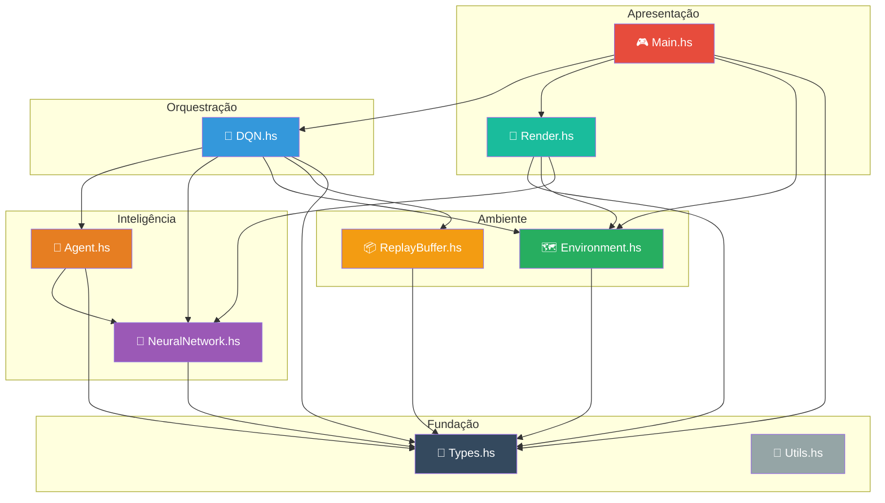
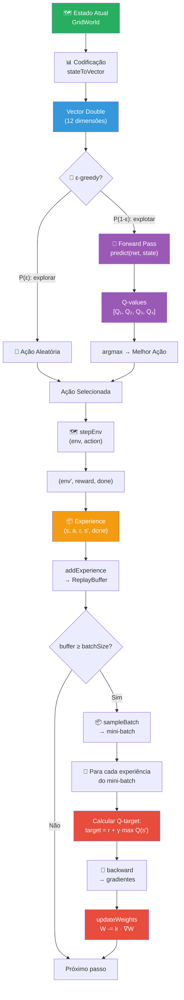
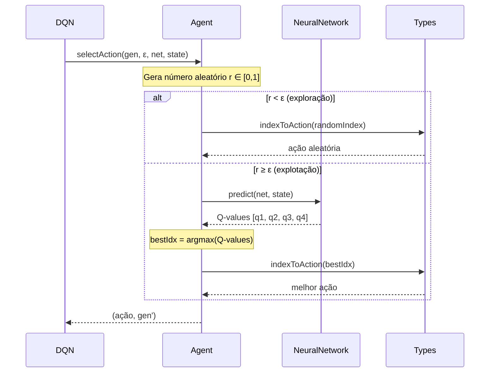
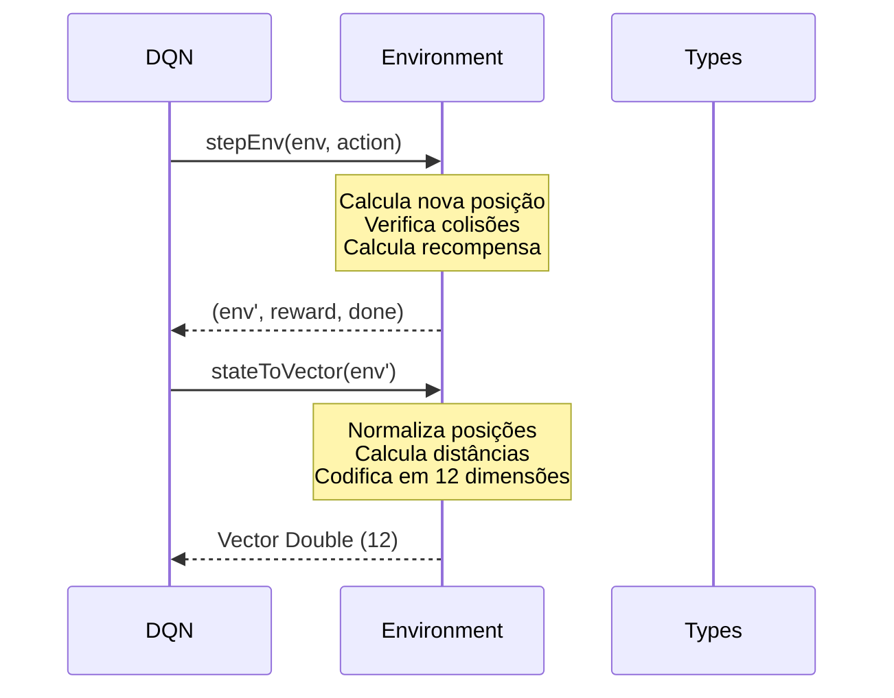
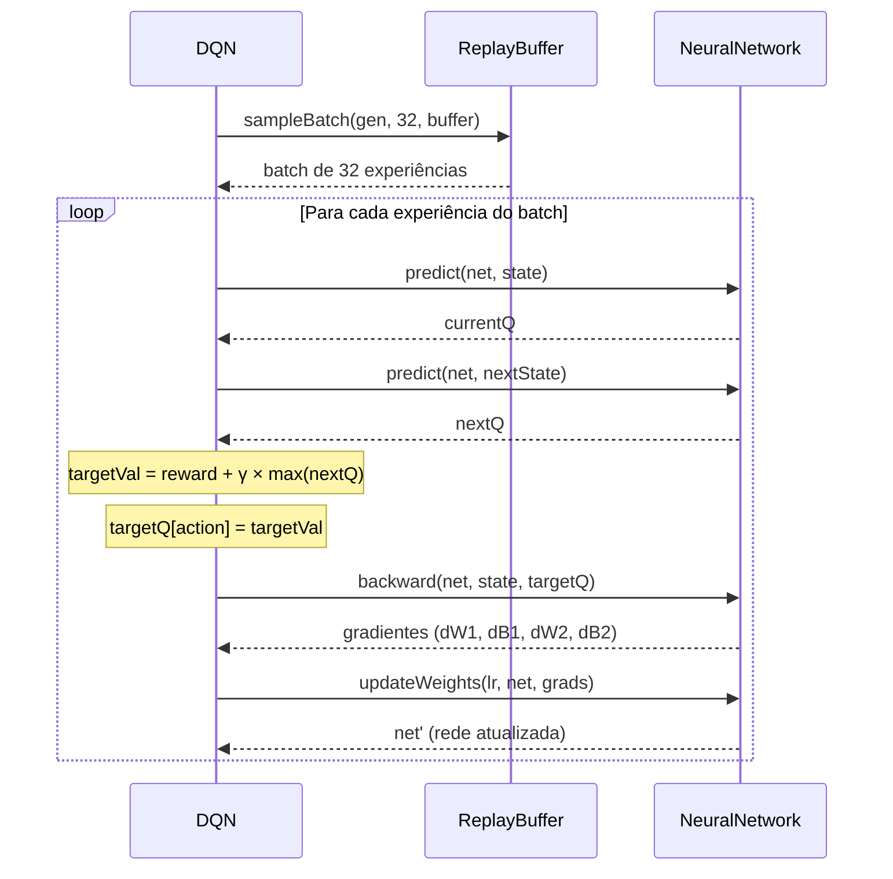
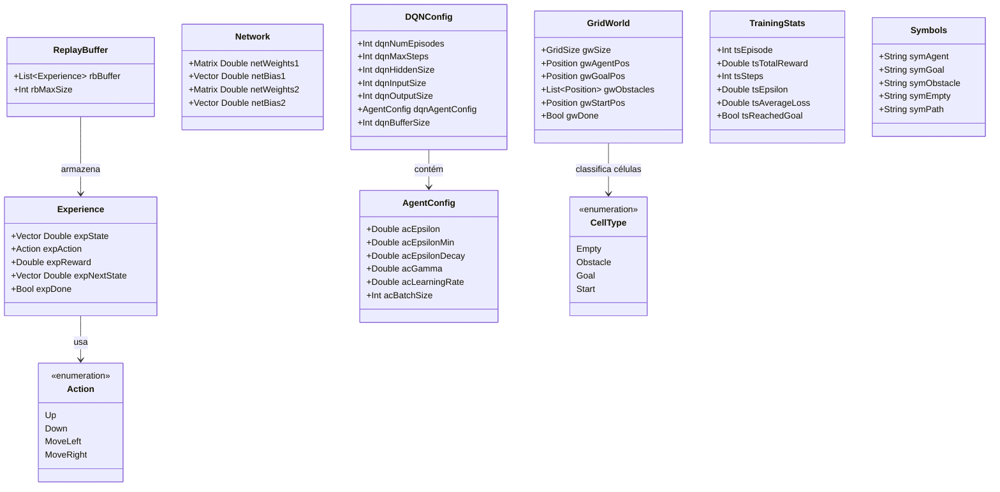

# 📐 Arquitetura do Projeto — Dungeon AI

> **Documento Técnico de Arquitetura**
> Projeto: gridworld-deepq-haskell | Versão: 0.1.0.0

---

## 📋 Índice

- [Visão Geral da Arquitetura](#-visão-geral-da-arquitetura)
- [Diagrama de Dependências entre Módulos](#-diagrama-de-dependências-entre-módulos)
- [Fluxo de Dados](#-fluxo-de-dados)
- [Responsabilidade de Cada Módulo](#-responsabilidade-de-cada-módulo)
- [Interação entre Módulos](#-interação-entre-módulos)
- [Decisões de Design](#-decisões-de-design)
- [Diagrama de Tipos de Dados](#-diagrama-de-tipos-de-dados)

---

## 🌐 Visão Geral da Arquitetura

O **Dungeon AI** segue uma arquitetura **modular e desacoplada**, característica de projetos em Haskell, onde cada módulo possui uma responsabilidade única e bem definida. A comunicação entre módulos é feita exclusivamente através de **tipos de dados compartilhados** definidos no módulo `Types.hs`, que serve como a fundação de todo o sistema.

### Princípios Arquiteturais

| Princípio | Aplicação |
|---|---|
| **Separação de Responsabilidades** | Cada módulo cuida de um aspecto específico do sistema |
| **Imutabilidade** | Todos os dados são imutáveis — transformações criam novos valores |
| **Pureza Funcional** | O core algorítmico (rede neural, DQN, ambiente) é puro, sem efeitos colaterais |
| **Tipagem Forte** | Tipos algébricos garantem correção em tempo de compilação |
| **Composição** | Funções complexas são compostas a partir de funções simples |
| **Baixo Acoplamento** | Módulos dependem de interfaces (tipos exportados), não de implementações internas |

### Camadas da Aplicação

```
┌──────────────────────────────────────────────────┐
│              CAMADA DE APRESENTAÇÃO               │
│         Main.hs  ←→  Render.hs                    │
│    (entrada do programa, visualização ASCII)       │
├──────────────────────────────────────────────────┤
│              CAMADA DE ORQUESTRAÇÃO               │
│                    DQN.hs                          │
│     (loop de treinamento, coordenação geral)       │
├──────────────────────────────────────────────────┤
│              CAMADA DE INTELIGÊNCIA               │
│        Agent.hs  ←→  NeuralNetwork.hs              │
│     (decisão de ações, aproximação de Q-values)    │
├──────────────────────────────────────────────────┤
│               CAMADA DE AMBIENTE                  │
│       Environment.hs  ←→  ReplayBuffer.hs          │
│     (simulação do grid, armazenamento de exp.)     │
├──────────────────────────────────────────────────┤
│               CAMADA DE FUNDAÇÃO                  │
│            Types.hs  ←→  Utils.hs                   │
│       (tipos de dados, funções utilitárias)         │
└──────────────────────────────────────────────────┘
```

---

## 🔗 Diagrama de Dependências entre Módulos

### Grafo Completo de Dependências



### Matriz de Dependências

A tabela abaixo indica quais módulos cada módulo importa (✅ = importa, ❌ = não importa):

| Módulo ↓ importa → | Types | Environment | NeuralNetwork | ReplayBuffer | Agent | DQN | Render | Utils |
|---|:---:|:---:|:---:|:---:|:---:|:---:|:---:|:---:|
| **Main.hs** | ✅ | ✅ | ❌ | ❌ | ❌ | ✅ | ✅ | ❌ |
| **DQN.hs** | ✅ | ✅ | ✅ | ✅ | ✅ | — | ❌ | ❌ |
| **Agent.hs** | ✅ | ❌ | ✅ | ❌ | — | ❌ | ❌ | ❌ |
| **NeuralNetwork.hs** | ✅ | ❌ | — | ❌ | ❌ | ❌ | ❌ | ❌ |
| **Environment.hs** | ✅ | — | ❌ | ❌ | ❌ | ❌ | ❌ | ❌ |
| **ReplayBuffer.hs** | ✅ | ❌ | ❌ | — | ❌ | ❌ | ❌ | ❌ |
| **Render.hs** | ✅ | ✅ | ✅ | ❌ | ❌ | ❌ | — | ❌ |
| **Utils.hs** | ❌ | ❌ | ❌ | ❌ | ❌ | ❌ | ❌ | — |

> [!NOTE]
> O módulo `Utils.hs` é completamente independente — não importa nenhum módulo interno do projeto. Ele oferece funções genéricas de utilidade que podem ser usadas por qualquer outro módulo.

---

## 🔄 Fluxo de Dados

### Ciclo Principal de Treinamento

O diagrama abaixo mostra o fluxo completo de dados durante um único passo de treinamento:



### Fluxo de um Episódio Completo

```
Episódio n:
  ┌─ Inicializar: env = resetEnv(gridWorld), ε = ε_atual
  │
  │  ┌─ Passo 1: observar estado → selecionar ação → executar → armazenar → treinar
  │  ├─ Passo 2: observar estado → selecionar ação → executar → armazenar → treinar
  │  ├─ ...
  │  └─ Passo k: alcançou objetivo OU max_steps → FIM do episódio
  │
  ├─ Registrar estatísticas (reward total, steps, loss, ε, sucesso)
  ├─ Decair ε: ε_novo = max(ε_min, ε × ε_decay)
  └─ Próximo episódio
```

---

## 📦 Responsabilidade de Cada Módulo

### 📐 `Types.hs` — Tipos de Dados Fundamentais

**Responsabilidade:** Definir todos os tipos de dados utilizados por todo o sistema. Este é o módulo central de "contratos" — todos os outros módulos dependem dele.

**Tipos exportados:**

| Tipo | Categoria | Descrição |
|---|---|---|
| `Position` | Type alias | `(Int, Int)` — posição (linha, coluna) no grid |
| `GridSize` | Type alias | `(Int, Int)` — dimensões (linhas, colunas) do grid |
| `Action` | ADT | `Up \| Down \| MoveLeft \| MoveRight` — ações do agente |
| `CellType` | ADT | `Empty \| Obstacle \| Goal \| Start` — tipos de célula |
| `GridWorld` | Record | Estado completo do ambiente (posições, obstáculos, done) |
| `Experience` | Record | Tupla (s, a, r, s', done) para replay |
| `ReplayBuffer` | Record | Lista de experiências com tamanho máximo |
| `Network` | Record | Pesos e biases da rede neural (W1, b1, W2, b2) |
| `AgentConfig` | Record | Hiperparâmetros do agente (ε, γ, lr, batch) |
| `TrainingStats` | Record | Estatísticas de um episódio de treinamento |
| `DQNConfig` | Record | Configuração completa do treinamento DQN |
| `Symbols` | Record | Símbolos para renderização (🧙💎🔥⬜🟢) |

**Funções auxiliares exportadas:**

```haskell
allActions    :: [Action]          -- [Up, Down, MoveLeft, MoveRight]
actionToIndex :: Action -> Int     -- Up=0, Down=1, MoveLeft=2, MoveRight=3
indexToAction :: Int -> Action     -- 0=Up, 1=Down, 2=MoveLeft, 3=MoveRight
numActions    :: Int               -- 4
defaultSymbols :: Symbols          -- Símbolos padrão com emojis
```

**Decisão de design:** Todos os tipos derivam `Generic` e possuem instâncias `NFData` para permitir avaliação estrita profunda (*deep strict evaluation*), prevenindo *space leaks* comuns em Haskell.

---

### 🗺️ `Environment.hs` — Ambiente Grid World

**Responsabilidade:** Implementar a lógica completa do ambiente Grid World — criação do grid, movimentação do agente, cálculo de recompensas e codificação do estado.

**Funções exportadas:**

| Função | Assinatura | Descrição |
|---|---|---|
| `mkGridWorld` | `GridWorld` | Cria o grid padrão 5×5 |
| `resetEnv` | `GridWorld → GridWorld` | Reseta o agente para posição inicial |
| `stepEnv` | `GridWorld → Action → (GridWorld, Double, Bool)` | Executa uma ação e retorna novo estado, recompensa e se terminou |
| `stateToVector` | `GridWorld → Vector Double` | Codifica o estado como vetor de 12 dimensões |
| `isValidPosition` | `GridWorld → Position → Bool` | Verifica se posição é válida |
| `cellAt` | `GridWorld → Position → CellType` | Retorna o tipo de célula em uma posição |
| `stateSize` | `Int` | Constante = 12 |

**Codificação do Estado (12 dimensões):**

```
Índice  Descrição                        Fórmula
──────  ──────────────────────────       ──────────────────
[0]     Posição do agente (linha)        agentRow / (rows-1)
[1]     Posição do agente (coluna)       agentCol / (cols-1)
[2]     Posição do objetivo (linha)      goalRow / (rows-1)
[3]     Posição do objetivo (coluna)     goalCol / (cols-1)
[4]     Distância ao objetivo (linha)    (goalRow - agentRow) / (rows-1)
[5]     Distância ao objetivo (coluna)   (goalCol - agentCol) / (cols-1)
[6-7]   Distância ao obstáculo 1         (obsRow - agentRow, obsCol - agentCol)
[8-9]   Distância ao obstáculo 2         (obsRow - agentRow, obsCol - agentCol)
[10-11] Distância ao obstáculo 3         (obsRow - agentRow, obsCol - agentCol)
```

> [!IMPORTANT]
> Todos os valores são normalizados para o intervalo aproximado [-1.0, 1.0]. A normalização é essencial para que a rede neural receba entradas em escala uniforme, facilitando o treinamento.

---

### 🔮 `NeuralNetwork.hs` — Rede Neural Artificial

**Responsabilidade:** Implementar uma rede neural feedforward de duas camadas com forward propagation, backpropagation, atualização de pesos e cálculo de perda.

**Funções exportadas:**

| Função | Assinatura | Descrição |
|---|---|---|
| `initNetwork` | `StdGen → Int → Int → Int → (Network, StdGen)` | Inicializa pesos com Xavier |
| `forward` | `Network → Vector → (output, hidden, z1)` | Forward pass completo |
| `predict` | `Network → Vector → Vector` | Retorna apenas a saída (Q-values) |
| `backward` | `Network → Vector → Vector → (dW1, dB1, dW2, dB2)` | Calcula gradientes |
| `updateWeights` | `Double → Network → grads → Network` | Atualiza pesos com gradient descent |
| `networkLoss` | `Vector → Vector → Double` | Calcula erro MSE |

**Funções internas:**

```haskell
relu           :: Vector Double -> Vector Double       -- max(0, x)
reluDerivative :: Vector Double -> Vector Double       -- 1 se x > 0, senão 0
```

**Fluxo do Forward Pass:**

```
input (12)  →  z1 = W1·input + b1  →  h = ReLU(z1)  →  z2 = W2·h + b2  →  output (4)
```

**Fluxo do Backward Pass:**

```
outputError = output - targetQ
dW2 = outer(outputError, hidden)
dB2 = outputError
hiddenError = W2^T · outputError
hiddenDelta = hiddenError * ReLU'(z1)
dW1 = outer(hiddenDelta, input)
dB1 = hiddenDelta
```

---

### 📦 `ReplayBuffer.hs` — Buffer de Experiências

**Responsabilidade:** Armazenar experiências *(s, a, r, s', done)* e permitir amostragem aleatória de mini-batches para treinamento.

**Funções exportadas:**

| Função | Assinatura | Descrição |
|---|---|---|
| `emptyBuffer` | `Int → ReplayBuffer` | Cria buffer vazio com tamanho máximo |
| `addExperience` | `Experience → ReplayBuffer → ReplayBuffer` | Adiciona experiência (LIFO com truncamento) |
| `sampleBatch` | `StdGen → Int → ReplayBuffer → ([Experience], StdGen)` | Amostra aleatória de n experiências |
| `bufferSize` | `ReplayBuffer → Int` | Retorna o número de experiências armazenadas |

**Estratégia de gerenciamento:**
- Novas experiências são adicionadas no **início da lista** (prepend — O(1))
- Quando o buffer excede o tamanho máximo, as experiências **mais antigas** são descartadas (`take maxSize`)
- A amostragem é feita com **reposição** (uma experiência pode ser amostrada múltiplas vezes no mesmo batch)

---

### 🎯 `Agent.hs` — Agente e Política de Ação

**Responsabilidade:** Implementar a política de seleção de ações ε-greedy e o decaimento do parâmetro de exploração.

**Funções exportadas:**

| Função | Assinatura | Descrição |
|---|---|---|
| `selectAction` | `StdGen → Double → Network → Vector → (Action, StdGen)` | Seleciona ação (ε-greedy) |
| `decayEpsilon` | `AgentConfig → AgentConfig` | Aplica decaimento exponencial a ε |
| `defaultAgentConfig` | `AgentConfig` | Configuração padrão do agente |

**Algoritmo ε-greedy:**

```
selectAction(gen, ε, net, state):
    r ← número aleatório uniforme [0, 1]
    se r < ε:
        retornar ação aleatória          ← EXPLORAÇÃO
    senão:
        qValues ← predict(net, state)
        retornar argmax(qValues)          ← EXPLOTAÇÃO
```

**Decaimento exponencial:**

```
ε_novo = max(ε_min, ε_atual × ε_decay)
       = max(0.01, ε_atual × 0.995)
```

---

### 🧠 `DQN.hs` — Loop de Treinamento Deep Q-Learning

**Responsabilidade:** Orquestrar todo o processo de treinamento — controlar os episódios, coordenar o agente com o ambiente, treinar a rede neural e coletar estatísticas.

**Funções exportadas:**

| Função | Assinatura | Descrição |
|---|---|---|
| `trainDQN` | `DQNConfig → StdGen → (Network, [TrainingStats])` | Função principal de treinamento |
| `trainStep` | `AgentConfig → Network → ReplayBuffer → StdGen → (Network, StdGen, Double)` | Um passo de treinamento com mini-batch |
| `runEpisode` | `... → (Network, ReplayBuffer, StdGen, ...)` | Executa um episódio completo |
| `defaultDQNConfig` | `DQNConfig` | Configuração padrão |

**Estado interno do treinamento (`TrainState`):**

```haskell
data TrainState = TrainState
  { tsNetwork     :: Network           -- rede neural atual
  , tsBuffer      :: ReplayBuffer      -- buffer de experiências
  , tsAgentCfg    :: AgentConfig       -- configuração do agente (com ε atual)
  , tsGen         :: StdGen            -- gerador de números aleatórios
  , tsAllStats    :: [TrainingStats]   -- estatísticas acumuladas
  }
```

**Cálculo do Q-target:**

```haskell
-- Para cada experiência (s, a, r, s', done) do mini-batch:
currentQ  = predict(net, s)                     -- Q-values atuais
nextQ     = predict(net, s')                    -- Q-values do próximo estado
maxNextQ  = if done then 0.0 else max(nextQ)    -- melhor Q-value futuro
targetVal = r + γ × maxNextQ                    -- target para a ação executada

-- targetQ é uma cópia de currentQ, substituindo apenas a ação executada:
targetQ[i] = currentQ[i]     para i ≠ actionIndex
targetQ[actionIndex] = targetVal
```

> [!WARNING]
> Quando o episódio termina (`done = True`), o `maxNextQ` é definido como 0.0, pois não há estados futuros. Isso é essencial para que a equação de Bellman funcione corretamente em estados terminais.

---

### 🎨 `Render.hs` — Renderização e Visualização

**Responsabilidade:** Gerar representações visuais ASCII do Grid World, estatísticas de treinamento e o caminho aprendido pelo agente.

**Funções exportadas:**

| Função | Assinatura | Descrição |
|---|---|---|
| `renderHeader` | `IO ()` | Exibe o cabeçalho do Dungeon AI |
| `renderGrid` | `Symbols → GridWorld → String` | Renderiza o grid como ASCII art |
| `renderGridWithPath` | `Symbols → GridWorld → [Position] → String` | Renderiza o grid com o caminho marcado |
| `renderTrainingStats` | `TrainingStats → String` | Formata estatísticas de um episódio |
| `renderFinalSummary` | `[TrainingStats] → IO ()` | Exibe resumo final do treinamento |
| `renderLearnedPath` | `Symbols → Network → IO ()` | Exibe o caminho aprendido pela rede treinada |

**Função auxiliar `tracePath`:** Usa a rede treinada para traçar greedily (sempre escolhendo a melhor ação) o caminho do início ao objetivo, limitado a 50 passos para evitar loops infinitos.

---

### 🔧 `Utils.hs` — Funções Utilitárias

**Responsabilidade:** Fornecer funções auxiliares genéricas que podem ser usadas por qualquer módulo.

**Funções exportadas:**

| Função | Assinatura | Descrição |
|---|---|---|
| `chunksOf` | `Int → [a] → [[a]]` | Divide lista em sub-listas de tamanho n |
| `movingAverage` | `Int → [Double] → [Double]` | Calcula média móvel com janela de tamanho n |
| `formatDuration` | `Double → String` | Formata duração em "Xm Ys" |
| `progressBar` | `Int → Int → Int → String` | Gera barra de progresso ASCII |
| `safeMaximum` | `[a] → Maybe a` | `maximum` seguro para listas vazias |
| `safeMinimum` | `[a] → Maybe a` | `minimum` seguro para listas vazias |

---

### 🎮 `Main.hs` — Ponto de Entrada

**Responsabilidade:** Orquestrar a execução do programa — exibir cabeçalho, configurar parâmetros, iniciar o treinamento, exibir progresso e resultados.

**Fluxo de execução:**

```
1. Exibir cabeçalho (renderHeader)
2. Exibir configuração
3. Renderizar grid inicial
4. Gerar semente aleatória (newStdGen)
5. Executar treinamento (trainDQN)
6. Exibir estatísticas de episódios selecionados
7. Exibir resumo final (renderFinalSummary)
8. Exibir caminho aprendido (renderLearnedPath)
```

**Critério de exibição de episódios:**
- Episódios 1-10: sempre exibidos (início do treinamento)
- A cada 25 episódios: exibido (progresso periódico)
- Último episódio: sempre exibido

---

## 🔀 Interação entre Módulos

### Cenário 1: Seleção de Ação



### Cenário 2: Interação com o Ambiente



### Cenário 3: Treinamento da Rede



---

## 💡 Decisões de Design

### 1. Por que Haskell?

| Vantagem | Explicação |
|---|---|
| **Pureza** | Funções puras facilitam raciocinar sobre o comportamento do algoritmo |
| **Tipos fortes** | Erros de lógica são capturados em tempo de compilação |
| **Imutabilidade** | Sem efeitos colaterais inesperados — cada transformação é explícita |
| **Lazy evaluation** | Permite trabalhar com estruturas potencialmente infinitas de forma eficiente |
| **Educacional** | Implementar IA em Haskell demonstra versatilidade da linguagem |

### 2. Por que rede neural manual em vez de um framework?

A decisão de implementar a rede neural do zero (sem TensorFlow, PyTorch ou similares) foi tomada por motivos **educacionais**:

- **Compreensão profunda**: Implementar forward/backward propagation manualmente garante entendimento completo do algoritmo
- **Transparência**: Cada operação matemática é explícita no código
- **Minimalismo**: Reduz dependências e complexidade de setup
- **Foco didático**: O objetivo é aprender, não otimizar performance

### 3. Por que `hmatrix` para álgebra linear?

A biblioteca `hmatrix` foi escolhida por:
- **Performance**: Wrapper para LAPACK/BLAS, altamente otimizado em C/Fortran
- **API natural**: Operadores como `#>` (multiplicação matriz-vetor) e `<>` (multiplicação de matrizes)
- **Maturidade**: Biblioteca estável e bem documentada no ecossistema Haskell

### 4. Por que Experience Replay com lista simples?

Em vez de usar uma estrutura de dados mais sofisticada (como `Seq` ou `Vector`), o replay buffer usa uma **lista Haskell** (`[Experience]`):

- **Simplicidade**: Fácil de entender e implementar
- **Prepend O(1)**: Adicionar no início da lista é O(1)
- **Trade-off**: Acesso indexado é O(n), mas para o tamanho do buffer (10.000) isso é aceitável
- **Suficiente**: Para fins educacionais, a performance é adequada

### 5. Por que `StdGen` explícito em vez de `IO`?

O gerador de números aleatórios (`StdGen`) é passado explicitamente como argumento e retornado como resultado, em vez de usar `IO` para geração aleatória. Isso mantém as funções de treinamento **puras**:

```haskell
-- PURO: StdGen explícito (abordagem utilizada)
selectAction :: StdGen -> Double -> Network -> Vector Double -> (Action, StdGen)

-- IMPURO: usando IO (abordagem evitada)
selectAction :: Double -> Network -> Vector Double -> IO Action
```

Vantagens da abordagem pura:
- **Reprodutibilidade**: mesma semente → mesmos resultados
- **Testabilidade**: testes unitários determinísticos
- **Composição**: facilita combinar funções puras

### 6. Extensões de Linguagem

O projeto utiliza extensões GHC selecionadas com propósitos específicos:

| Extensão | Propósito |
|---|---|
| `ScopedTypeVariables` | Permite anotar tipos em expressões locais |
| `BangPatterns` | Força avaliação estrita para prevenir space leaks |
| `DeriveGeneric` | Derivação automática de `Generic` para `NFData` |
| `StrictData` | Campos de records são estritos por padrão |

> [!TIP]
> `StrictData` e `BangPatterns` são particularmente importantes neste projeto para evitar acúmulo de thunks no buffer de experiências e nas estatísticas de treinamento, prevenindo *space leaks*.

---

## 📊 Diagrama de Tipos de Dados

### Hierarquia de Tipos



---

## 📏 Métricas do Código

| Módulo | Linhas | Funções Exportadas | Dependências Internas |
|---|:---:|:---:|:---:|
| `Types.hs` | 139 | 5 (+ 12 tipos) | 0 |
| `Environment.hs` | 94 | 7 | 1 (Types) |
| `NeuralNetwork.hs` | 82 | 6 | 1 (Types) |
| `ReplayBuffer.hs` | 39 | 4 | 1 (Types) |
| `Agent.hs` | 41 | 3 | 2 (Types, NeuralNetwork) |
| `DQN.hs` | 106 | 4 | 5 (Types, Env, NN, RB, Agent) |
| `Render.hs` | 178 | 6 | 3 (Types, Env, NeuralNetwork) |
| `Utils.hs` | 56 | 6 | 0 |
| `Main.hs` | 54 | 1 | 4 (Types, Env, DQN, Render) |
| `Spec.hs` | 187 | 1 (main) | 5 (Types, Env, NN, RB, Agent) |
| **Total** | **976** | **43** | — |

---

<div align="center">

*Documentação gerada para o projeto Dungeon AI — Deep Q-Learning em Haskell*

📐 Arquitetura | [🧠 DQN](deep-q-learning.md) | [🔮 Rede Neural](neural-network.md) | [🎓 Apresentação](presentation.md)

</div>
