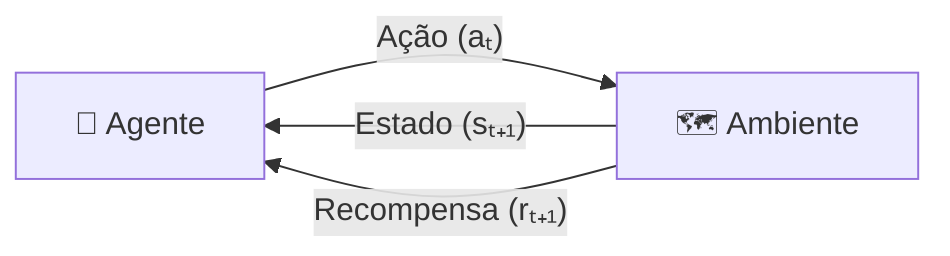
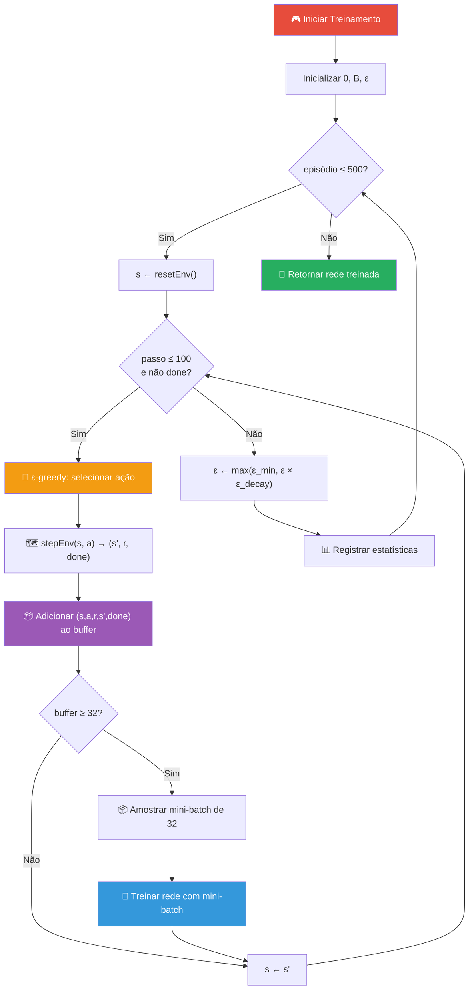

# 🧠 Deep Q-Learning — Fundamentos Teóricos

> **Documento de Referência Teórica**
> Projeto: gridworld-deepq-haskell | Versão: 0.1.0.0

---

## 📋 Índice

- [O que é Aprendizado por Reforço](#-o-que-é-aprendizado-por-reforço)
- [Processo de Decisão de Markov (MDP)](#-processo-de-decisão-de-markov-mdp)
- [Q-Learning](#-q-learning)
- [Limitações do Q-Learning Tabular](#-limitações-do-q-learning-tabular)
- [Deep Q-Learning (DQN)](#-deep-q-learning-dqn)
- [A Equação de Bellman](#-a-equação-de-bellman)
- [Experience Replay](#-experience-replay)
- [Exploração ε-Greedy](#-exploração-ε-greedy)
- [Fator de Desconto (γ)](#-fator-de-desconto-γ)
- [Função de Perda](#-função-de-perda)
- [Algoritmo de Treinamento](#-algoritmo-de-treinamento)
- [Implementação no Projeto](#-implementação-no-projeto)
- [Referências](#-referências)

---

## 🤖 O que é Aprendizado por Reforço

O **Aprendizado por Reforço** (*Reinforcement Learning*, RL) é um paradigma de aprendizado de máquina onde um **agente** aprende a tomar decisões interagindo com um **ambiente**. Diferentemente do aprendizado supervisionado (onde temos exemplos rotulados) e do não-supervisionado (onde buscamos padrões em dados), no RL o agente aprende por **tentativa e erro**, recebendo **recompensas** ou **penalidades** como feedback.

### Os Três Paradigmas de Machine Learning

```
┌─────────────────────────────────────────────────────────────────┐
│                    MACHINE LEARNING                              │
├──────────────────┬──────────────────┬───────────────────────────┤
│  Supervisionado  │ Não-Supervisionado│  Aprendizado por Reforço  │
│                  │                  │                            │
│  - Classificação │  - Clustering    │  - Agente + Ambiente       │
│  - Regressão     │  - PCA           │  - Recompensas             │
│                  │  - Autoencoders  │  - Política ótima          │
│  Dados:          │  Dados:          │  Dados:                    │
│  (x, y) rotulado │  (x) sem rótulo  │  (s, a, r, s') interação  │
│                  │                  │                            │
│  Ex: Spam filter │  Ex: Agrupamento │  Ex: Jogos, Robótica      │
└──────────────────┴──────────────────┴───────────────────────────┘
```

### Ciclo Agente-Ambiente

No Aprendizado por Reforço, o agente interage com o ambiente em ciclos discretos:



**Em cada passo de tempo *t*:**

1. O agente **observa** o estado atual `sₜ`
2. O agente **seleciona** uma ação `aₜ` baseada em sua política
3. O ambiente **transiciona** para um novo estado `sₜ₊₁`
4. O ambiente **retorna** uma recompensa `rₜ₊₁`
5. O agente **atualiza** sua política com base na experiência

### Aplicação no Projeto Dungeon AI

| Componente RL | Implementação no Projeto |
|---|---|
| **Agente** | O mago 🧙 controlado pela rede neural |
| **Ambiente** | Grid World 5×5 (dungeon) |
| **Estado** | Vetor de 12 dimensões (posições normalizadas) |
| **Ações** | Up, Down, MoveLeft, MoveRight |
| **Recompensa** | +100 (tesouro), -100 (armadilha), -1 (movimento), -2 (parede) |
| **Política** | ε-greedy com rede neural para Q-values |

---

## 📐 Processo de Decisão de Markov (MDP)

O framework formal para problemas de RL é o **Processo de Decisão de Markov** (*Markov Decision Process*, MDP), definido pela tupla:

```
MDP = (S, A, P, R, γ)
```

| Símbolo | Nome | Descrição |
|:---:|---|---|
| **S** | Espaço de estados | Conjunto de todos os estados possíveis |
| **A** | Espaço de ações | Conjunto de todas as ações possíveis |
| **P** | Função de transição | P(s' \| s, a) — probabilidade de ir para s' dado (s, a) |
| **R** | Função de recompensa | R(s, a, s') — recompensa por transição |
| **γ** | Fator de desconto | γ ∈ [0, 1] — importância de recompensas futuras |

### Propriedade de Markov

A propriedade essencial de Markov afirma que o estado futuro depende **apenas** do estado e ação atuais, não do histórico:

```
P(sₜ₊₁ | sₜ, aₜ, sₜ₋₁, aₜ₋₁, ...) = P(sₜ₊₁ | sₜ, aₜ)
```

O Grid World satisfaz essa propriedade naturalmente: o próximo estado depende apenas da posição atual do agente e da ação escolhida.

### MDP no Projeto Dungeon AI

| Componente MDP | Valor no Projeto |
|---|---|
| **S** | 25 posições × {done, not_done} = 50 estados possíveis |
| **A** | {Up, Down, MoveLeft, MoveRight} = 4 ações |
| **P** | Determinística: P(s' \| s, a) ∈ {0, 1} |
| **R** | +100, -100, -1, -2 (conforme a transição) |
| **γ** | 0.99 |

---

## 📊 Q-Learning

### O que é a Função Q?

A **função Q** (ou **função de valor-ação**) `Q(s, a)` estima o **retorno esperado** (soma de recompensas futuras descontadas) ao tomar a ação `a` no estado `s` e, em seguida, seguir a política ótima:

```
Q*(s, a) = E[rₜ + γ·rₜ₊₁ + γ²·rₜ₊₂ + ... | sₜ = s, aₜ = a]
```

Em outras palavras, `Q*(s, a)` responde à pergunta: *"Qual é o valor total (presente + futuro) de tomar a ação `a` no estado `s`?"*

### A Política Ótima

Uma vez que temos Q* (a função Q ótima), a **política ótima** é simplesmente escolher, em cada estado, a ação com maior Q-value:

```
π*(s) = argmax_a Q*(s, a)
```

### Algoritmo Q-Learning Tabular

O Q-Learning clássico mantém uma **tabela Q** e a atualiza a cada experiência:

```
Inicializar Q(s, a) = 0 para todos (s, a)

Para cada episódio:
    s ← estado inicial
    Enquanto s não for terminal:
        a ← selecionar ação usando ε-greedy sobre Q(s, ·)
        Executar a, observar r, s'
        Q(s, a) ← Q(s, a) + α · [r + γ · max_a' Q(s', a') - Q(s, a)]
        s ← s'
```

### Regra de Atualização

A regra de atualização do Q-Learning é:

```
Q(s, a) ← Q(s, a) + α · δ
```

Onde:
- **α** — taxa de aprendizado (learning rate)
- **δ** — erro de diferença temporal (TD error):

```
δ = r + γ · max_a' Q(s', a') - Q(s, a)
    ├── "target" ──────────────┘        │
    │                                    │
    └──────── "previsão atual" ──────────┘
```

### Exemplo com a Tabela Q

Para um grid 5×5 com 4 ações, a tabela Q teria 25 × 4 = 100 entradas:

```
Estado (row,col) │   Up    │  Down   │  Left   │  Right
─────────────────┼─────────┼─────────┼─────────┼─────────
     (0, 0)      │  -15.2  │   23.4  │  -12.0  │   18.7
     (0, 1)      │  -18.3  │   12.1  │  -15.2  │   45.2
     (0, 2)      │    5.6  │   -8.4  │   12.1  │  -95.0
     ...         │   ...   │   ...   │   ...   │   ...
     (4, 3)      │   12.3  │  -15.0  │   45.2  │   95.0
     (4, 4)      │    0.0  │    0.0  │    0.0  │    0.0
```

---

## ⚠️ Limitações do Q-Learning Tabular

O Q-Learning tabular funciona bem para problemas pequenos, mas possui limitações fundamentais:

| Limitação | Descrição |
|---|---|
| **Explosão de estados** | Para espaços de estados grandes ou contínuos, a tabela Q se torna impraticável |
| **Sem generalização** | Cada estado é tratado independentemente — aprender sobre (0,0) não ajuda em (0,1) |
| **Memória** | Armazenar Q(s,a) para todos os pares requer O(\|S\| × \|A\|) memória |
| **Convergência lenta** | Cada entrada da tabela precisa ser visitada muitas vezes |

### Exemplo de Explosão de Estados

| Problema | Estados | Ações | Entradas na Tabela Q |
|---|:---:|:---:|:---:|
| Grid 5×5 | 25 | 4 | 100 |
| Grid 100×100 | 10.000 | 4 | 40.000 |
| Atari (pixels) | ~10^33.600 | ~18 | ∞ (impossível) |
| Xadrez | ~10^47 | ~30 | ∞ (impossível) |

> [!IMPORTANT]
> Para problemas reais com milhares ou milhões de estados, a abordagem tabular é **completamente inviável**. É aqui que o Deep Q-Learning se torna necessário.

---

## 🧠 Deep Q-Learning (DQN)

### A Ideia Central

O **Deep Q-Learning** (DQN), proposto por Mnih et al. (2015) no artigo seminal "*Human-level control through deep reinforcement learning*", substitui a tabela Q por uma **rede neural profunda** que **aproxima** a função Q:

```
Q(s, a) ≈ Q(s, a; θ)
```

Onde **θ** representa os parâmetros (pesos e biases) da rede neural.

### Comparação Visual

```
Q-Learning Tabular:                 Deep Q-Learning:

  Tabela Q[s][a]                      Rede Neural
  ┌───┬───┬───┬───┐                   ┌───┐
  │   │   │   │   │                   │ s │ ─── Entrada
  ├───┼───┼───┼───┤                   └─┬─┘
  │   │   │   │   │     ───►            │
  ├───┼───┼───┼───┤                   ┌─┴─┐
  │   │   │   │   │                   │ h │ ─── Camada Oculta
  └───┴───┴───┴───┘                   └─┬─┘
  S estados × A ações                   │
                                      ┌─┴─────────────┐
                                      │Q(s,a₁) ... Q(s,aₙ)│ ─── Saída
                                      └────────────────┘
                                      Parâmetros fixos (θ)
```

### Vantagens do DQN sobre Q-Learning Tabular

| Aspecto | Q-Learning Tabular | Deep Q-Learning |
|---|---|---|
| **Representação** | Tabela explícita | Rede neural (parâmetros θ) |
| **Generalização** | Nenhuma | Generaliza entre estados similares |
| **Escalabilidade** | O(\|S\| × \|A\|) memória | Parâmetros fixos, independente de \|S\| |
| **Estados contínuos** | Impossível | Naturalmente suportado |
| **Convergência** | Lenta, cada estado visitado separadamente | Mais rápida com generalização |

### Inovações do DQN Original (DeepMind, 2015)

O artigo original do DQN introduziu duas técnicas cruciais para estabilizar o treinamento:

1. **Experience Replay** — armazenar e reamostrar experiências passadas
2. **Target Network** — rede separada para calcular Q-targets (não implementada neste projeto educacional)

---

## 📏 A Equação de Bellman

### Equação de Bellman para Q*

A **Equação de Bellman de Otimalidade** define a relação recursiva entre os Q-values ótimos:

```
Q*(s, a) = E[r + γ · max_a' Q*(s', a') | sₜ = s, aₜ = a]
```

Para ambientes determinísticos (como nosso Grid World):

```
Q*(s, a) = R(s, a) + γ · max_a' Q*(s', a')
```

### Derivação Intuitiva

A ideia é que o valor de tomar uma ação `a` no estado `s` é:

```
Q*(s, a) = recompensa_imediata + desconto × melhor_valor_futuro
         = r                   + γ       × max_a' Q*(s', a')
```

### Exemplo Numérico no Grid World

Considere o agente na posição (3, 4), adjacente ao tesouro em (4, 4):

```
Q*((3,4), Down) = r + γ × max_a' Q*((4,4), a')
                = 100 + 0.99 × 0        ← estado terminal, Q* = 0
                = 100

Q*((3,4), Up)   = r + γ × max_a' Q*((2,4), a')
                = -1 + 0.99 × max_a' Q*((2,4), a')
```

O agente aprende que `Q*((3,4), Down) = 100` é muito maior que qualquer outra ação nessa posição, então **sempre escolherá ir para baixo** quando estiver em (3, 4).

### Propagação de Valores

Com o tempo, os Q-values se propagam "para trás" a partir do objetivo:

```
Episódio 1:    Q((3,4), Down) ≈ 100
Episódio 10:   Q((2,4), Down) ≈ -1 + 0.99×100 = 98.0
Episódio 50:   Q((1,4), Down) ≈ -1 + 0.99×98 = 96.0
Episódio 100:  Q((0,4), Down) ≈ -1 + 0.99×96 = 94.0
...
```

---

## 📦 Experience Replay

### Motivação

No Q-Learning ingênuo, a rede é treinada com experiências **sequenciais** — cada experiência é usada uma vez e descartada. Isso causa dois problemas:

1. **Correlação temporal**: Experiências consecutivas são altamente correlacionadas (a posição (2,3) é seguida por (2,4) ou similar), o que viola a suposição de dados i.i.d. (independentes e identicamente distribuídos) necessária para gradiente estocástico
2. **Desperdício de dados**: Cada experiência é usada apenas uma vez

### Como Funciona

O **Experience Replay Buffer** resolve ambos os problemas:

```
┌────────────────────────────────────────────────────────┐
│                 REPLAY BUFFER (tamanho máximo: 10000)  │
├────────────────────────────────────────────────────────┤
│ exp_1: (s₁, a₁, r₁, s'₁, done₁)                      │
│ exp_2: (s₂, a₂, r₂, s'₂, done₂)                      │
│ exp_3: (s₃, a₃, r₃, s'₃, done₃)                      │
│ ...                                                    │
│ exp_n: (sₙ, aₙ, rₙ, s'ₙ, doneₙ)                      │
├────────────────────────────────────────────────────────┤
│            ↓ Amostragem Aleatória ↓                    │
│     Mini-batch de 32 experiências aleatórias           │
│     → Usado para treinar a rede neural                 │
└────────────────────────────────────────────────────────┘
```

### Implementação no Projeto

No módulo `ReplayBuffer.hs`:

```haskell
-- Estrutura do buffer
data ReplayBuffer = ReplayBuffer
  { rbBuffer   :: [Experience]    -- lista de experiências
  , rbMaxSize  :: Int             -- capacidade máxima (10000)
  }

-- Adicionar experiência (prepend + truncate)
addExperience :: Experience -> ReplayBuffer -> ReplayBuffer
addExperience exp' buf =
  let newBuffer = exp' : rbBuffer buf        -- adiciona no início
      trimmed   = take (rbMaxSize buf) newBuffer  -- limita tamanho
  in buf { rbBuffer = trimmed }

-- Amostrar mini-batch aleatório
sampleBatch :: StdGen -> Int -> ReplayBuffer -> ([Experience], StdGen)
```

### Benefícios

| Benefício | Descrição |
|---|---|
| **Descorrelação** | Amostras aleatórias quebram a correlação temporal |
| **Reutilização** | Cada experiência pode ser usada múltiplas vezes |
| **Eficiência** | Aproveita melhor cada interação com o ambiente |
| **Estabilidade** | Gradientes mais estáveis → convergência mais suave |

---

## 🎲 Exploração ε-Greedy

### O Dilema Exploração vs. Explotação

Um dos desafios centrais do RL é o **dilema exploração-explotação** (*exploration-exploitation tradeoff*):

- **Exploração** (*exploration*): Tentar ações novas/aleatórias para descobrir recompensas desconhecidas
- **Explotação** (*exploitation*): Usar o conhecimento já adquirido para maximizar a recompensa

```
┌─────────────────────────────────────────────────┐
│           EXPLORAÇÃO vs EXPLOTAÇÃO               │
├─────────────────────┬───────────────────────────┤
│     EXPLORAÇÃO      │       EXPLOTAÇÃO          │
│                     │                           │
│  "Tentar algo novo" │  "Usar o que já sei"      │
│                     │                           │
│  🎲 Ação aleatória  │  🎯 Melhor ação conhecida │
│                     │                           │
│  Descobrir caminhos │  Otimizar o caminho       │
│  desconhecidos      │  já conhecido             │
│                     │                           │
│  Risco de erro,     │  Risco de perder          │
│  mas pode encontrar │  soluções melhores        │
│  soluções melhores  │                           │
└─────────────────────┴───────────────────────────┘
```

### Política ε-Greedy

A solução mais comum é a política **ε-greedy**: com probabilidade ε, o agente explora (ação aleatória); com probabilidade 1-ε, o agente explota (melhor ação conhecida):

```
π_ε(s) = {
    ação aleatória de A,     com probabilidade ε
    argmax_a Q(s, a; θ),     com probabilidade 1 - ε
}
```

### Decaimento de ε

No início do treinamento, ε é alto (1.0 = 100% exploração) para que o agente descubra o ambiente. Gradualmente, ε decai para um valor mínimo (0.01 = 1% exploração), permitindo que o agente use o conhecimento adquirido:

```
ε_novo = max(ε_min, ε_atual × ε_decay)
```

### Curva de Decaimento

Com os parâmetros do projeto (`ε₀ = 1.0`, `ε_decay = 0.995`, `ε_min = 0.01`):

```
Episódio   │  ε          │ Comportamento
───────────┼─────────────┼────────────────────────────
    1      │  1.000      │ 100% aleatório
   50      │  0.778      │ 78% aleatório
  100      │  0.606      │ 61% aleatório
  200      │  0.367      │ 37% aleatório
  300      │  0.223      │ 22% aleatório
  400      │  0.135      │ 14% aleatório
  500      │  0.082      │ 8% aleatório
  920      │  ~0.01      │ 1% aleatório (mínimo)
 1000+     │  0.01       │ 1% aleatório (estável)
```

### Implementação no Projeto

No módulo `Agent.hs`:

```haskell
selectAction :: StdGen -> Double -> Network -> Vector Double -> (Action, StdGen)
selectAction gen epsilon net state =
  let (r, gen') = randomR (0.0 :: Double, 1.0) gen
  in if r < epsilon
     then randomAction gen'             -- EXPLORAÇÃO
     else
       let qValues = predict net state   -- EXPLOTAÇÃO
           bestIdx = maxIndex qValues
       in (indexToAction bestIdx, gen')

decayEpsilon :: AgentConfig -> AgentConfig
decayEpsilon cfg =
  let newEps = max (acEpsilonMin cfg) (acEpsilon cfg * acEpsilonDecay cfg)
  in cfg { acEpsilon = newEps }
```

---

## 🎚️ Fator de Desconto (γ)

### O que é γ?

O **fator de desconto** (gamma, γ) determina o quanto o agente valoriza recompensas futuras em relação a recompensas imediatas. Formalmente, o **retorno** (soma de recompensas descontadas) é:

```
Gₜ = rₜ₊₁ + γ·rₜ₊₂ + γ²·rₜ₊₃ + ... = Σ_{k=0}^{∞} γᵏ · rₜ₊ₖ₊₁
```

### Interpretação de γ

| Valor de γ | Interpretação | Comportamento |
|:---:|---|---|
| **γ = 0** | Completamente "míope" | Maximiza apenas a recompensa imediata |
| **γ = 0.5** | Equilibrado | Recompensa 4 passos no futuro vale ~6% |
| **γ = 0.99** | Visão de longo prazo | Recompensa 100 passos no futuro vale ~37% |
| **γ = 1** | Sem desconto | Todas as recompensas futuras têm igual peso |

### Efeito de γ no Grid World

Com γ = 0.99 (valor usado neste projeto), o agente olha muito "para frente":

```
Recompensa daqui a 1 passo:  γ¹  = 0.99¹  = 0.990  (99.0%)
Recompensa daqui a 5 passos: γ⁵  = 0.99⁵  = 0.951  (95.1%)
Recompensa daqui a 8 passos: γ⁸  = 0.99⁸  = 0.923  (92.3%)
Recompensa daqui a 20 passos: γ²⁰ = 0.99²⁰ = 0.818  (81.8%)
```

O caminho ótimo de (0,0) a (4,4) requer pelo menos 8 passos. Com γ = 0.99, o tesouro (+100) a 8 passos de distância vale:

```
Q((0,0), caminho ótimo) ≈ -1 - 0.99 - 0.99² - ... - 0.99⁶ + 0.99⁷ × 100
                        ≈ -6.8 + 93.2
                        ≈ 86.4
```

> [!NOTE]
> O γ = 0.99 foi escolhido para que o agente planeje o caminho completo até o tesouro, mesmo que esteja a muitos passos de distância. Um valor menor (ex: 0.5) faria o agente ser "míope" e não se mover em direção a recompensas distantes.

---

## 📉 Função de Perda

### Mean Squared Error (MSE)

A função de perda do DQN mede a diferença entre os Q-values **previstos** pela rede e os Q-values **alvo** (calculados pela equação de Bellman):

```
L(θ) = (1/n) × Σᵢ (Q(sᵢ, aᵢ; θ) - yᵢ)²
```

Onde o **target** yᵢ é:

```
yᵢ = rᵢ + γ × max_a' Q(s'ᵢ, a'; θ)    se não terminal
yᵢ = rᵢ                                  se terminal (done = True)
```

### Decomposição da Perda

```
L(θ) = MSE(Q_previsto, Q_target)

     = (1/n) × Σ (previsão - alvo)²

     = (1/n) × Σ (Q(s,a;θ) - [r + γ·max Q(s',a';θ)])²
                   ↑                     ↑
              rede neural           equação de Bellman
```

### Gradiente da Perda

O gradiente da perda em relação aos parâmetros θ é:

```
∇_θ L(θ) = (2/n) × Σᵢ (Q(sᵢ, aᵢ; θ) - yᵢ) × ∇_θ Q(sᵢ, aᵢ; θ)
```

### Implementação no Projeto

No módulo `NeuralNetwork.hs`:

```haskell
networkLoss :: Vector Double -> Vector Double -> Double
networkLoss predicted target =
  let diff    = predicted `add` scale (-1.0) target     -- predicted - target
      squared = cmap (\x -> x * x) diff                  -- (predicted - target)²
  in sumElements squared / fromIntegral (size predicted)  -- média
```

No módulo `DQN.hs`, o cálculo do target Q-value:

```haskell
updateFromExperience :: AgentConfig -> (Network, Double) -> Experience -> (Network, Double)
updateFromExperience cfg (net, accLoss) exp' =
  let currentQ  = predict net (expState exp')          -- Q-values atuais
      nextQ     = predict net (expNextState exp')      -- Q-values do próximo estado
      maxNextQ  = if expDone exp' then 0.0             -- terminal: sem futuro
                  else maxElement nextQ                 -- não-terminal: melhor futuro
      targetVal = expReward exp' + acGamma cfg * maxNextQ  -- equação de Bellman
      targetQ   = fromList [ if i == actionIdx then targetVal
                             else toList currentQ !! i
                           | i <- [0 .. numActions - 1] ]
      grads     = backward net (expState exp') targetQ
      net'      = updateWeights (acLearningRate cfg) net grads
      loss      = networkLoss (predict net (expState exp')) targetQ
  in (net', accLoss + loss)
```

> [!WARNING]
> Observe que o `targetQ` preserva os Q-values atuais para todas as ações exceto a ação executada. Apenas o Q-value da ação executada é substituído pelo target calculado pela equação de Bellman. Isso garante que o gradiente não afete as previsões para ações que não foram testadas.

---

## 📝 Algoritmo de Treinamento

### Pseudocódigo Completo do DQN

```
Algoritmo: Deep Q-Learning com Experience Replay
─────────────────────────────────────────────────

Entrada:
    num_episódios = 500
    max_passos = 100
    γ = 0.99                    (fator de desconto)
    α = 0.001                   (taxa de aprendizado)
    ε₀ = 1.0                   (epsilon inicial)
    ε_min = 0.01               (epsilon mínimo)
    ε_decay = 0.995            (fator de decaimento)
    batch_size = 32            (tamanho do mini-batch)
    buffer_size = 10000        (capacidade do replay buffer)
    hidden_size = 64           (neurônios na camada oculta)

Inicialização:
    θ ← inicializar_pesos_xavier(input=12, hidden=64, output=4)
    B ← buffer_vazio(capacidade=10000)
    ε ← 1.0

Para episódio = 1, 2, ..., 500:
    s ← reset_ambiente()                      ← agente volta para (0,0)
    R_total ← 0
    
    Para passo = 1, 2, ..., 100:
        ┌─ SELEÇÃO DE AÇÃO (ε-greedy)
        │  r ~ Uniforme(0, 1)
        │  Se r < ε:
        │      a ← ação_aleatória()           ← EXPLORAÇÃO
        │  Senão:
        │      Q ← forward(θ, s)              ← Forward pass
        │      a ← argmax(Q)                  ← EXPLOTAÇÃO (melhor ação)
        └──────────────────────────────────
        
        ┌─ INTERAÇÃO COM AMBIENTE
        │  (s', r, done) ← step(s, a)         ← Executar ação
        │  R_total ← R_total + r
        └──────────────────────────────────
        
        ┌─ ARMAZENAR EXPERIÊNCIA
        │  B ← B ∪ {(s, a, r, s', done)}      ← Adicionar ao buffer
        └──────────────────────────────────
        
        ┌─ TREINAR REDE (se buffer suficiente)
        │  Se |B| ≥ batch_size:
        │      batch ← amostrar_aleatório(B, 32)   ← Amostrar mini-batch
        │      
        │      Para cada (sᵢ, aᵢ, rᵢ, s'ᵢ, doneᵢ) em batch:
        │          Q_atual ← forward(θ, sᵢ)
        │          
        │          Se doneᵢ:
        │              y_target ← rᵢ                    ← Estado terminal
        │          Senão:
        │              Q_próx ← forward(θ, s'ᵢ)
        │              y_target ← rᵢ + γ × max(Q_próx)  ← Bellman
        │          
        │          Q_target ← Q_atual (cópia)
        │          Q_target[aᵢ] ← y_target              ← Substituir apenas a ação executada
        │          
        │          ∇θ ← backward(θ, sᵢ, Q_target)       ← Calcular gradientes
        │          ∇θ ← clip(∇θ, -1, 1)                 ← Gradient clipping
        │          θ ← θ - α × ∇θ                       ← Atualizar pesos
        └──────────────────────────────────
        
        s ← s'
        Se done: SAIR do loop de passos
    
    ┌─ ATUALIZAR EXPLORAÇÃO
    │  ε ← max(ε_min, ε × ε_decay)
    └──────────────────────────────────
    
    Registrar estatísticas(episódio, R_total, passos, ε, loss)

Retornar θ (rede treinada), estatísticas
```

### Diagrama de Fluxo



---

## 💻 Implementação no Projeto

### Mapeamento Algoritmo → Código

| Conceito Teórico | Módulo | Função |
|---|---|---|
| Inicialização Xavier | `NeuralNetwork.hs` | `initNetwork` |
| Forward pass | `NeuralNetwork.hs` | `forward`, `predict` |
| Backward pass (gradientes) | `NeuralNetwork.hs` | `backward` |
| Atualização de pesos | `NeuralNetwork.hs` | `updateWeights` |
| Função de perda (MSE) | `NeuralNetwork.hs` | `networkLoss` |
| Seleção ε-greedy | `Agent.hs` | `selectAction` |
| Decaimento de ε | `Agent.hs` | `decayEpsilon` |
| Interação com ambiente | `Environment.hs` | `stepEnv` |
| Codificação de estado | `Environment.hs` | `stateToVector` |
| Armazenar experiência | `ReplayBuffer.hs` | `addExperience` |
| Amostrar mini-batch | `ReplayBuffer.hs` | `sampleBatch` |
| Loop de treinamento | `DQN.hs` | `trainDQN`, `runEpisode` |
| Calcular Q-target | `DQN.hs` | `updateFromExperience` |
| Treinar com mini-batch | `DQN.hs` | `trainStep` |

### Constantes e Hiperparâmetros

```haskell
-- Em DQN.hs (defaultDQNConfig):
dqnNumEpisodes = 500          -- Número de episódios
dqnMaxSteps    = 100          -- Passos máximos por episódio
dqnHiddenSize  = 64           -- Neurônios na camada oculta
dqnInputSize   = 12           -- Dimensão do vetor de estado
dqnOutputSize  = 4            -- Número de ações
dqnBufferSize  = 10000        -- Capacidade do replay buffer

-- Em Agent.hs (defaultAgentConfig):
acEpsilon      = 1.0          -- Epsilon inicial
acEpsilonMin   = 0.01         -- Epsilon mínimo
acEpsilonDecay = 0.995        -- Fator de decaimento
acGamma        = 0.99         -- Fator de desconto
acLearningRate = 0.001        -- Taxa de aprendizado
acBatchSize    = 32           -- Tamanho do mini-batch

-- Em Environment.hs:
gridSize       = (5, 5)       -- Dimensões do grid
startPosition  = (0, 0)       -- Posição inicial
goalPosition   = (4, 4)       -- Posição do objetivo
obstacles      = [(0,3), (1,1), (2,3), (3,1)]
rewardGoal     = +100.0       -- Recompensa por atingir o objetivo
rewardObstacle = -100.0       -- Penalidade por cair em armadilha
rewardWall     = -2.0         -- Penalidade por bater na parede
rewardStep     = -1.0         -- Custo por movimento
```

---

## 🔬 Conceitos Avançados (Não Implementados)

Este projeto implementa o DQN básico. Abaixo estão extensões que poderiam melhorar o desempenho:

### Double DQN

Resolve o problema de **superestimação** dos Q-values ao usar a rede principal para **selecionar** a melhor ação e a rede target para **avaliar** essa ação:

```
y = r + γ × Q_target(s', argmax_a' Q_online(s', a'))
```

### Dueling DQN

Separa a estimativa de Q-value em **valor do estado** V(s) e **vantagem da ação** A(s, a):

```
Q(s, a) = V(s) + A(s, a) - mean_a'(A(s, a'))
```

### Prioritized Experience Replay

Em vez de amostrar uniformemente do buffer, prioriza experiências com **maior erro TD** (maior diferença entre previsão e target):

```
P(i) ∝ |δᵢ|^α, onde δᵢ = Q(s,a) - y
```

### Target Network

Usa uma cópia "congelada" da rede para calcular os targets, atualizada periodicamente:

```
A cada C passos: θ_target ← θ_online
y = r + γ × max_a' Q(s', a'; θ_target)
```

---

## 📚 Referências

1. **Mnih, V., et al.** (2015). *Human-level control through deep reinforcement learning*. Nature, 518(7540), 529-533.

2. **Watkins, C. J. C. H., & Dayan, P.** (1992). *Q-learning*. Machine Learning, 8(3-4), 279-292.

3. **Sutton, R. S., & Barto, A. G.** (2018). *Reinforcement Learning: An Introduction* (2nd ed.). MIT Press.

4. **Bellman, R.** (1957). *Dynamic Programming*. Princeton University Press.

5. **Van Hasselt, H., Guez, A., & Silver, D.** (2016). *Deep Reinforcement Learning with Double Q-learning*. AAAI.

6. **Wang, Z., et al.** (2016). *Dueling Network Architectures for Deep Reinforcement Learning*. ICML.

7. **Schaul, T., et al.** (2015). *Prioritized Experience Replay*. ICLR.

---

<div align="center">

*Documentação teórica para o projeto Dungeon AI — Deep Q-Learning em Haskell*

[📐 Arquitetura](architecture.md) | 🧠 DQN | [🔮 Rede Neural](neural-network.md) | [🎓 Apresentação](presentation.md)

</div>
